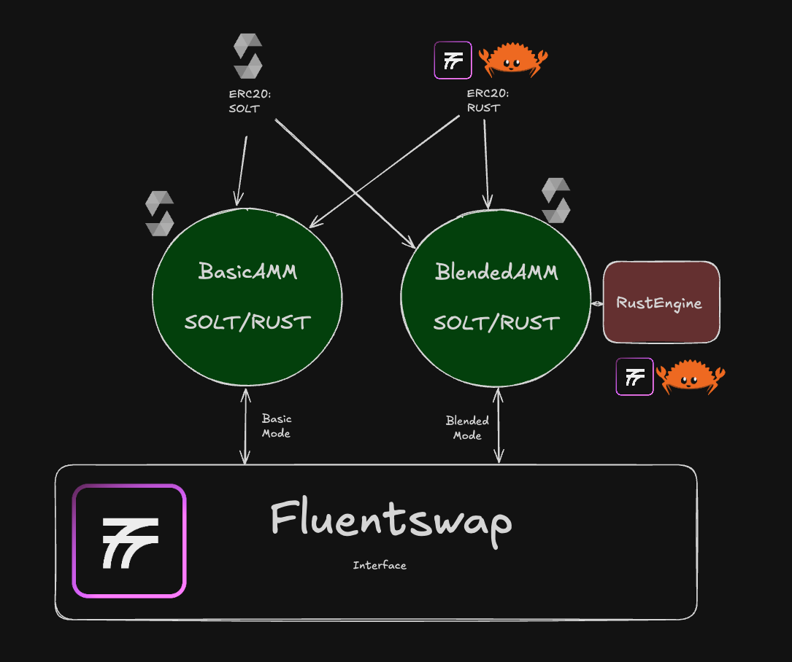

# Fluent Workshop Series

Follow along with the first of the workshops (Fluentbase SDK 101), with these repos:

- **Backend**: https://github.com/tmsdkeys/fluent-dual-erc20-with-AMM
- **Frontend**: https://github.com/fluentlabs-xyz/fluentswap-demo-frontend

## Workshop 1: Challenge

- The backend repo https://github.com/tmsdkeys/fluent-dual-erc20-with-AMM has a full copy of ERC20 token contracts (in Solidity & Fluentbase Rust). Upgrade the project to have a TokenFactory structure (look at Solidity reference materials and try it for the Rust contract) such that we can easily create new tokens by setting some initial params.
- Add a token registry in Fluentbase Rust to keep track of the tokens you've created using the factory.
- Bonus: Build only one registry (Rust) that registers both types of tokens (Solidity & Rust)
